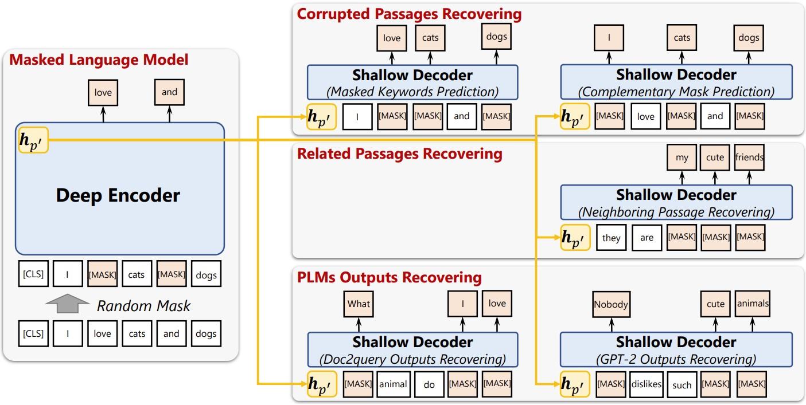

# SimXNS

[✨Updates](#️UPDATES) | [📜Citation](#Citation) | [🤘Furthermore](#Furthermore) | [❤️Contributing](#Contributing) | [📚Trademarks](#Trademarks)

[SimXNS](https://aka.ms/simxns) is a research project for information retrieval by MSRA NLC IR team. Some of the techniques are actively used in [Microsoft Bing](https://www.bing.com/). This repo provides the official code implementations.

Currently, this repo contains `SimANS` and `MASTER`, and all these methods are designed for information retrieval.
Here are some basic descriptions to help you catch up with the characteristics of each work:
- [**SimANS**](https://arxiv.org/abs/2210.11773) is a simple, general and flexible ambiguous negatives sampling method for dense text retrieval. It can be easily applied to various dense retrieval methods like [AR2](https://github.com/microsoft/AR2). We tested this method on the [MS MARCO](https://microsoft.github.io/msmarco/), [Natural Questions](https://ai.google.com/research/NaturalQuestions/) and [TriviaQA](http://nlp.cs.washington.edu/triviaqa/), and outperformed the state-of-the-art methods. This method is also applied in [Bing](https://www.bing.com/) search engine, which is proven to be effective. The whole magic is behind this formula.

- [**MASTER**](https://arxiv.org/abs/2212.07841) is a multi-task pre-trained model that unifies and integrates multiple pre-training tasks with different learning objectives under the bottlenecked masked autoencoder architecture.

We tested this method on the [MS MARCO](https://microsoft.github.io/msmarco/), [Natural Questions](https://ai.google.com/research/NaturalQuestions/) and [BEIR](https://github.com/beir-cellar/beir). This method outperforms the state-of-the-art methods.

## Updates

- 2022/11/17: release the official code of [SimANS](https://github.com/microsoft/SimXNS/tree/main/SimANS).
- 2022/12/16: release the official code of [MASTER](https://github.com/microsoft/SimXNS/tree/main/MASTER).


## Citation
If you extend or use this work, please cite our paper where it was introduced:


- **SimANS: Simple Ambiguous Negatives Sampling for Dense Text Retrieval**. Kun Zhou, Yeyun Gong, Xiao Liu, Wayne Xin Zhao, Yelong Shen, Anlei Dong, Jingwen Lu, Rangan Majumder, Ji-Rong Wen, Nan Duan, Weizhu Chen. ***EMNLP 2022***. [Code](https://github.com/microsoft/SimXNS/tree/main/SimANS), [Paper](https://arxiv.org/abs/2210.11773).
- **MASTER: Multi-task Pre-trained Bottlenecked Masked Autoencoders are Better Dense Retrievers**. Kun Zhou, Xiao Liu, Yeyun Gong, Wayne Xin Zhao, Daxin Jiang, Nan Duan, Ji-Rong Wen. ***arXiv***. [Code](https://github.com/microsoft/SimXNS/tree/main/MASTER), [Paper](https://arxiv.org/abs/2212.07841).

```bibtex
@article{zhou2022simans,
   title={SimANS: Simple Ambiguous Negatives Sampling for Dense Text Retrieval},
   author={Kun Zhou, Yeyun Gong, Xiao Liu, Wayne Xin Zhao, Yelong Shen, Anlei Dong, Jingwen Lu, Rangan Majumder, Ji-Rong Wen, Nan Duan and Weizhu Chen},
   booktitle = {{EMNLP}},
   year={2022}
}
@article{zhou2022master,
   title={MASTER: Multi-task Pre-trained Bottlenecked Masked Autoencoders are Better Dense Retrievers},
   author={Kun Zhou, Xiao Liu, Yeyun Gong, Wayne Xin Zhao, Daxin Jiang, Nan Duan, Ji-Rong Wen},
   booktitle = {{arXiv}},
   year={2022}
}
```


## Furthermore

This repo is still developing, feel free to report bugs and we will fix them.


## Contributing

This project welcomes contributions and suggestions.  Most contributions require you to agree to a
Contributor License Agreement (CLA) declaring that you have the right to, and actually do, grant us
the rights to use your contribution. For details, visit https://cla.opensource.microsoft.com.

When you submit a pull request, a CLA bot will automatically determine whether you need to provide
a CLA and decorate the PR appropriately (e.g., status check, comment). Simply follow the instructions
provided by the bot. You will only need to do this once across all repos using our CLA.

This project has adopted the [Microsoft Open Source Code of Conduct](https://opensource.microsoft.com/codeofconduct/).
For more information see the [Code of Conduct FAQ](https://opensource.microsoft.com/codeofconduct/faq/) or
contact [opencode@microsoft.com](mailto:opencode@microsoft.com) with any additional questions or comments.


## Trademarks

This project may contain trademarks or logos for projects, products, or services. Authorized use of Microsoft 
trademarks or logos is subject to and must follow 
[Microsoft's Trademark & Brand Guidelines](https://www.microsoft.com/en-us/legal/intellectualproperty/trademarks/usage/general).
Use of Microsoft trademarks or logos in modified versions of this project must not cause confusion or imply Microsoft sponsorship.
Any use of third-party trademarks or logos are subject to those third-party's policies.
