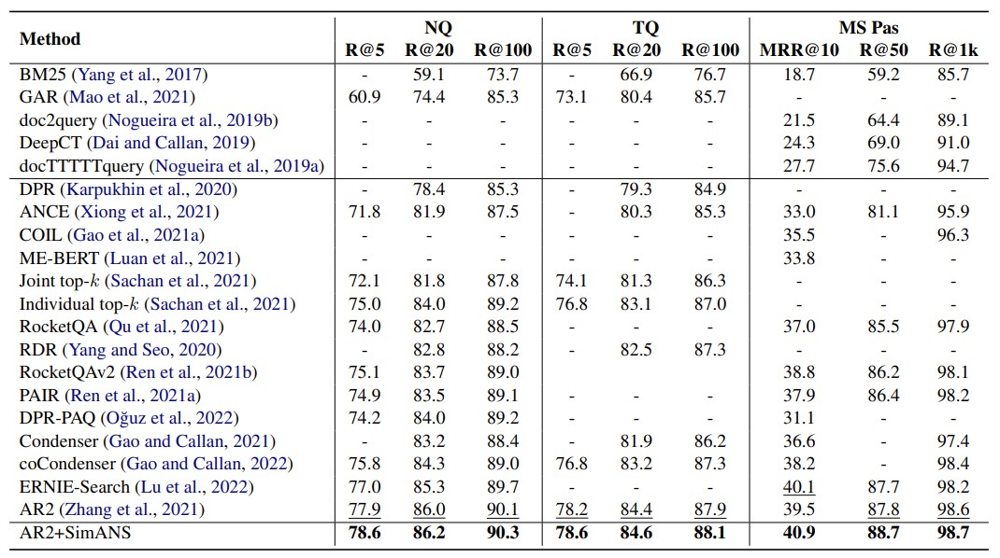

# SimANS: Simple Ambiguous Negatives Sampling for Dense Text Retrieval

This repository contains the code for our paper [***SimANS: Simple Ambiguous Negatives Sampling for Dense Text Retrieval***](https://arxiv.org/abs/2210.11773).


## 🚀 Overview

We propose ***SimANS***, a simple, general and flexible ambiguous negatives sampling method for dense text retrieval. It can be easily applied to various dense retrieval methods.

The key code of our SimANS is the implementation of the sampling distribution as:

$$p_{i} \propto \exp{(-a\cdot(s(q,d_{i})-s(q,\tilde{d}^{+})-b)^{2})}, \forall~d_{i} \in \hat{\mathcal{D}}^{-}$$

```python
def SimANS(pos_pair, neg_pairs_list):
    pos_id, pos_score = int(pos_pair[0]), float(pos_pair[1])
    neg_candidates, neg_scores = [], []
    for pair in neg_pairs_list:
        neg_id, neg_score = pair
        neg_score = math.exp(-(neg_score - pos_score) ** 2 * self.tau)
        neg_candidates.append(neg_id)
        neg_scores.append(neg_score)
    return random.choices(neg_candidates, weights=neg_scores, k=num_hard_negatives)
```

Here we show the main results on [MS MARCO](https://microsoft.github.io/msmarco/), [Natural Questions](https://ai.google.com/research/NaturalQuestions/) and [TriviaQA](http://nlp.cs.washington.edu/triviaqa/). This method outperformes the state-of-the-art methods.


This method has been applied in [Microsoft Bing](https://www.bing.com/), and we also show the results on the industry dataset.
<!--  -->
<div align=center>  </div>

Please find more details in the paper.


## 🙋 How to Use

**⚙️ Environment Setting**

To faithfully reproduce our results, please use the correct `1.7.1` pytorch version corresponding to your platforms/CUDA versions according to [Released Packages by pytorch](https://anaconda.org/pytorch/pytorch), and install faiss successfully for evaluation.

We list our command to prepare the experimental environment as follows:
```bash
conda install pytorch==1.7.1 cudatoolkit=11.0 -c pytorch
conda install faiss-gpu cudatoolkit=11.0 -c pytorch
conda install transformers
pip install tqdm
pip install tensorboardX
pip install lmdb
pip install datasets
pip install wandb
pip install sklearn
pip install boto3
```

**💾 Data and Initial Checkpoint**

We list the necessary data for training on MS-Pas/MS-Doc/NQ/TQ [here](https://msranlcir.blob.core.windows.net/simxns/SimANS/data.zip). You can download the compressed file and put the content in `./data`.
If you are working on MS-Pas, you will need this [additional file](https://msranlcir.blob.core.windows.net/simxns/SimANS/data/MS-Pas/qrels.train.addition.tsv) for training.

In our approach, we require to use the checkpoint from AR2 for initialization. We release them [here](https://msranlcir.blob.core.windows.net/simxns/SimANS/ckpt.zip). You can download the compressed file and put the content in `./ckpt`.

**📋 Training Scripts**

We provide the training scripts using SimANS on SOTA AR2 model for MS-MARCO-Passage/Document Retrieval, NQ and TQ datasets, and have set up the best hyperparameters for training. You can run it to automatically finish the training and evaluation.
```bash
bash train_MS_Pas_AR2.sh
bash train_MS_Doc_AR2.sh
bash train_NQ_AR2.sh
bash train_TQ_AR2.sh
```

For results in the paper, we use 8 * A100 GPUs with CUDA 11. Using different types of devices or different versions of CUDA/other softwares may lead to different performance.

**⚽ Best SimANS Checkpoint**

For better reproducing our experimental results, we also release all the checkpoint of our approach [here](https://msranlcir.blob.core.windows.net/simxns/SimANS/best_simans_ckpt.zip). You can download the compressed file and reuse the content for evaluation.


## 📜 Citation

Please cite our paper if you use [SimANS](https://arxiv.org/abs/2210.11773) in your work:
```bibtex
@article{zhou2022simans,
   title={SimANS: Simple Ambiguous Negatives Sampling for Dense Text Retrieval},
   author={Kun Zhou, Yeyun Gong, Xiao Liu, Wayne Xin Zhao, Yelong Shen, Anlei Dong, Jingwen Lu, Rangan Majumder, Ji-Rong Wen, Nan Duan and Weizhu Chen},
   booktitle = {{EMNLP}},
   year={2022}
}
```
